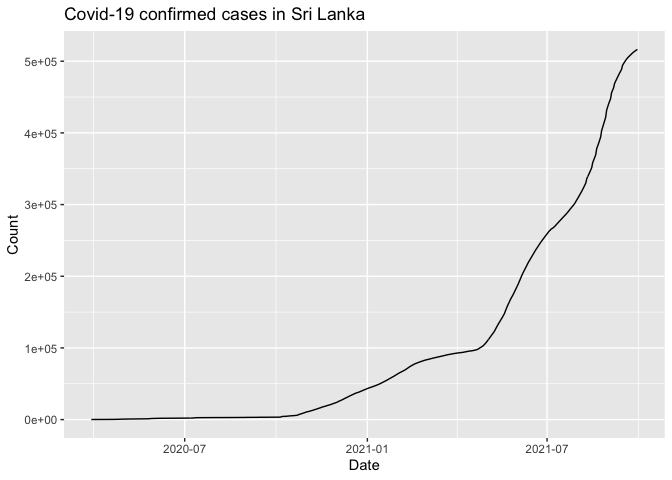

<!-- README.md is generated from README.Rmd. Please edit that file -->

# covid19srilanka <a href='https://github.com/thiyangt/covid19srilanka'></a>

<!-- badges: start -->
<!-- badges: end -->

The covid19srilanka package provides a tidy format dataset of the 2019
Novel Coronavirus COVID-19 (2019-nCoV) epidemic in Sri Lanka

## Installation

You can install the development version from
[GitHub](https://github.com/) with:

``` r
# install.packages("devtools")
devtools::install_github("thiyangt/covid19srilanka")
```

## Example

``` r
library(coronavirus)
```

## Covid-19 Cases in Sri Lanka

``` r
data("covid.cases")
head(covid.cases)
#>         Date      Type Count
#> 1 2020-03-29 Confirmed   115
#> 2 2020-03-29 Recovered    10
#> 3 2020-03-29    Deaths     1
#> 4 2020-03-29    Active   104
#> 5 2020-03-30 Confirmed   120
#> 6 2020-03-30 Recovered    11
tail(covid.cases)
#>            Date      Type  Count
#> 2195 2021-09-29    Deaths  12786
#> 2196 2021-09-29   Actives  45881
#> 2197 2021-09-30 Confirmed 516465
#> 2198 2021-09-30 Recovered 457488
#> 2199 2021-09-30    Deaths  12847
#> 2200 2021-09-30   Actives  46130
```

## District-wise Covid-19 Cases in Sri Lanka

``` r
data("district.wise.cases")
head(district.wise.cases)
#>         Date   District Count
#> 1 2021-08-01    Colombo 71267
#> 2 2021-08-01    Gampaha 56085
#> 3 2021-08-01   Kalutara 33300
#> 4 2021-08-01      Kandy 14576
#> 5 2021-08-01 Kurunagala 15327
#> 6 2021-08-01      Galle 14841
```

## Vaccination Details in Sri Lanka

``` r
data("vaccination")
head(vaccination)
#>         Date            Vaccine first dose Second dose
#> 1 2021-04-29 Covishield Vaccine     925242        3445
#> 2 2021-04-29  Sinopharm Vaccine       2469        2435
#> 3 2021-04-30 Covishield Vaccine     925242       22919
#> 4 2021-04-30  Sinopharm Vaccine       2865        2435
#> 5 2021-05-01 Covishield Vaccine     925242       60757
#> 6 2021-05-01  Sinopharm Vaccine       2865        2435
```

# Example

``` r
library(tidyverse)
#> ── Attaching packages ─────────────────────────────────────── tidyverse 1.3.1 ──
#> ✓ ggplot2 3.3.5     ✓ purrr   0.3.4
#> ✓ tibble  3.1.5     ✓ dplyr   1.0.7
#> ✓ tidyr   1.1.4     ✓ stringr 1.4.0
#> ✓ readr   2.0.2     ✓ forcats 0.5.1
#> ── Conflicts ────────────────────────────────────────── tidyverse_conflicts() ──
#> x dplyr::filter() masks stats::filter()
#> x dplyr::lag()    masks stats::lag()
covid.cases %>% filter(Type=="Confirmed") %>% ggplot(aes(x=Date, y=Count)) + geom_line() + ggtitle("Covid-19 confirmed cases in Sri Lanka")
```


